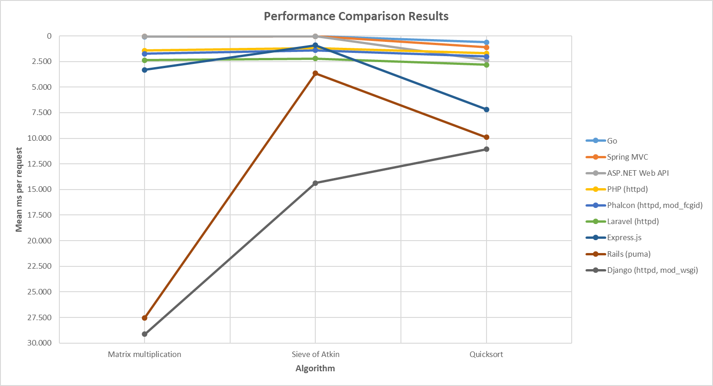
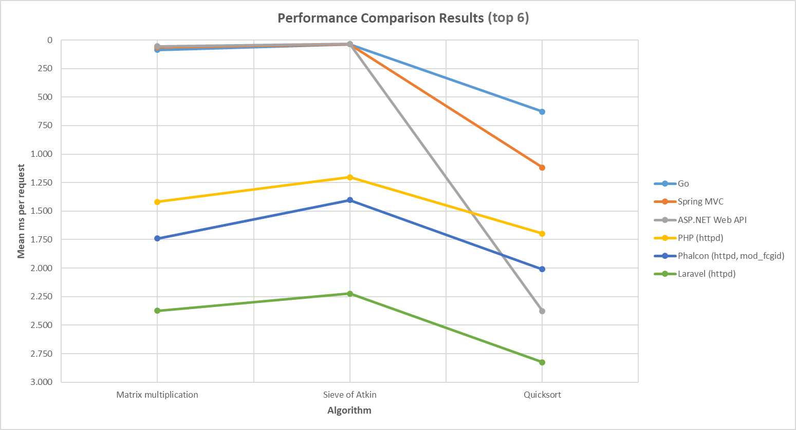
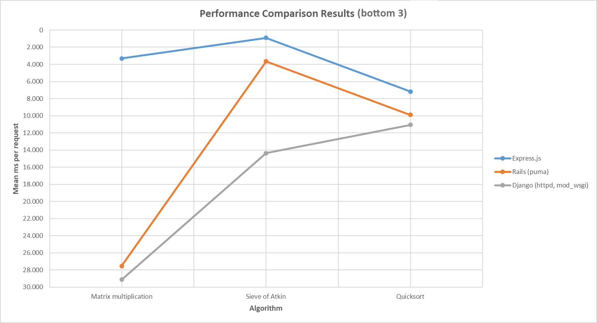

# Performance Comparison of Web Server Backend Frameworks

This project is an investigation into the comparative performance of some commonly used web server backend frameworks and technologies: ASP.NET Web API, Django, Express.js, Go, Laravel, Phalcon, PHP (no framework), Rails, Spring MVC. To evaluate performance selected algorithms were adapted to and run in a minimal web application built using each framework, time of execution being the criterion of comparison.

The executed algorithms are representative of three common CPU problem areas:

1. Integer arithmetic: a straight-forward unoptimized square matrix multiplication algorithm,

2. Prime number generation: sieve of Atkin, source: [GeeksforGeeks](https://www.geeksforgeeks.org/sieve-of-atkin/),

3. String sorting: quicksort, source: [GeeksforGeeks](https://www.geeksforgeeks.org/quick-sort/).

For each algorithm a referential implementation in C is provided in the 'Other/Algorithms' directory; note: the C implementation of Quicksort compares integers and in that form it is more suitable as referential.

An argument could be made that since the selected problem areas originate from CPU benchmarking they might not be as approriate for evaluating performance of web server technologies. The main assumption which gives the project solid foundations, that performance on the selected algorithms sufficiently correlates to that on the typical web server work situations, is considered reasonable by the author. Consequent to the algorithm selection is that the results foremost demonstrate the high-performance potential of the frameworks and technologies, subsequently being an account of real-world framework performance to the extent of the implication, this extent being deemed sufficient.

## Execution

### Procedure

For each framework the algorithms are implemented adhering to its established development conventions to the largest possible extent with no violations to the original structure. The input of each algorithm is generated upfront, in a script or method called 'init', and is stored in [memcached](https://memcached.org/); an external cache store had to be utilized as not all technologies preserve data between requests in memory, consequently cache reads are included in the measurement results. Algorithm output is discarded. All default framework middleware which is redundant in context has been removed. While in general best efforts have been made for each framework to run optimally in a production-like server environment, optimizations requiring extensive familiarity with the respected framework and / or server were not attempted. Details of the execution evironments are listed in the section [Development and server setup](#development-and-server-setup). After the server has been set up, HTTP requests were being repeatedly sent to the each endpoint which executes its corresponding algorithm.

### Measurement

The [ApacheBench](https://httpd.apache.org/docs/2.4/programs/ab.html) tool was used for sending requests to the server, in the following general manner:

`ab -n 5000 -c 100 server-endpoint-url > algorithm_name.txt`

Making 5.000 requests to each corresponding URL, issued in batches of 100, constitutes high-load testing; while the mean time per request would likely be lower under lower server load, at least for some algorithm-framework pairs, it is considered unlikely that this difference would invalidate the resulting position of a framework in the comparison results given the alternative conditions.

The evaluation was made on a machine with a quad-core CPU with base frequency of 3.6 GHz and 16 GB of RAM running a Windows 10 Enterprise OS. The tool output can be found in the 'results' subdirectory for each framework directory.

### Algorithm parameters

The algorithm parameters effective in execution were as follows:

- Matrix multiplication: dimension - 100.

- Sieve of Atkin: limit - 250.000.

- Quicksort: collection size - 30.000, string length - 100.

The values of the parameters were chosen so that the following constraints are satisfied:

1. most of the request processing time is spent running the algorithm itself as opposed to routing or middleware,

2. time per request and memory consumption are kept at reasonable levels.

## Development and server setup

This section lists framework and server version along with other development or environment setup details for each framework in alphabetical order, with the exception of the cache server being given upfront.

### Memcached

Memcached 1.4.5 64-bit server was used in conjunction with every framework in the following manner:

`memcached -I 10m`

The size of the maximum value that can be stored is increased from the default 1 MB to 10 MB due to the input data of matrix multiplication and quicksort algorithms being a few megabytes large given the effective parameters.

### ASP.NET Web API

IIS Express 10.0.14358.1000 running CLR v4.0.

### Django

Python 3.7.0 64-bit, Django 2.1.1. Server is Apache httpd 2.4.34 64-bit VC15 with mod_wsgi.

### Express.js

Node.js 8.12.0 64-bit, Express.js 4.16.3.

### Go

Go 1.11 64-bit.

### Laravel

Laravel 5.7.1. See PHP and server details under PHP. `ThreadsPerChild` for mpm_worker_module had to be increased to 50 from the default 25 in httpd-mpm.conf.

### Phalcon

Phalcon 3.4.1. See PHP and server details under PHP. Using mod_fcgid 2.3.9 64-bit VC15 as a workaround for [an issue](https://github.com/phalcon/cphalcon/issues/12056) with thread-safe PHP; this configuration yields slightly lower performance compared to using the php7_module.

### PHP

PHP 7.2.9 64-bit Thread Safe VC15, run on server Apache httpd 2.4.34 64-bit VC15. Nginx is the more appropriate choice for PHP server, however the Windows platform eliminated this possibility. The older 'memcache' module is used instead of 'memcached' for cache server communication, again due to the running platform. php.ini and httpd.conf files are provided in 'env-config-files' subdirectory.

### Rails

Ruby 2.5.1p57, Rails 5.2.1. Run on Puma 3.12.0 with min threads being 10 and max threads being 150.

### Spring MVC

Apache Tomcat 9.0.12, JRE 10.0.2 64-bit, Spring 5.0.0.RELEASE. Tomcat's memory pool was increased to 4096MB from the default 256MB using Tomcat9w.exe, Java tab, Maximum memory pool field.

## Results

The statistics reported from Apache Bench results output are `Time per request (mean)` in milliseconds and `[+/-sd]` over `Mean` for row Total in percentages.

The following table summarizes the results, ordering the frameworks by descending performance, the sum of the means is used to resolve ambiguous cases.

|                            | Matrix multiplication |   Sieve of Atkin    |      Quicksort      |
| :------------------------- | :-------------------: | :-----------------: | :-----------------: |
| Go                         | 85.751 +/- 30.4%      | 37.958 +/- 16.6%    | 627.022 +/- 115.9%  |
| Spring MVC                 | 63.530 +/- 66.6%      | 36.223 +/- 37.8%    | 1117.427 +/- 15.8%  |
| ASP.NET Web API            | 54.175 +/- 19.8%      | 35.844 +/- 22.6%    | 2376.846 +/- 9.2%   |
| PHP (httpd)                | 1419.207 +/- 6.2%     | 1203.141 +/- 7.7%   | 1697.957 +/- 22.5%  |
| Phalcon (httpd, mod_fcgid) | 1741.121 +/- 324%     | 1402.253 +/- 219.2% | 2009.939 +/- 182.9% |
| Laravel (httpd)            | 2373.852 +/- 5.6%     | 2223.450 +/- 8.3%   | 2824.965 +/- 9%     |
| Express.js                 | 3312.481 +/- 6.5%     | 911.800 +/- 6.4%    | 7179.1 +/- 10.1%    |
| Rails (puma)               | 27529.518 +/- 61.9%   | 3647.638 +/- 62.9%  | 9887.460 +/- 58.9%  |
| Django (httpd, mod_wsgi)   | 29128.659 +/- 15.1%   | 14362.927 +/- 13.7% | 11071.213 +/- 12%   |

The Express.js framework was unable to handle the high-load for quicksort algorithm execution and was run sequentially; the mean statistic for this run is adjusted by the effective concurrency level.

Django and Rails achieve comparatively lower performance on matrix multiplication which is to be expected since the respective implementations preserve the original algorithm structure in cases when this does not result in the preferred and optimal problem solution.

The high standard deviation and few failed requests in Phalcon results are likely a consequence of the high load on mod_fcgid despite its overly-permitting configuration; under default configuration, there are slightly more errors for each algorithm, approximately 5, and the standrad deviation is somewhat smaller, likely due to there being more failed requests.

The following chart summarizes the results graphically, separate views of the top 6 and bottom 3 y-axis values are provided to better accentuate these areas of interest.

A potential future improvement of the presentation of the results would be to use a custom D3.js chart for visualization.